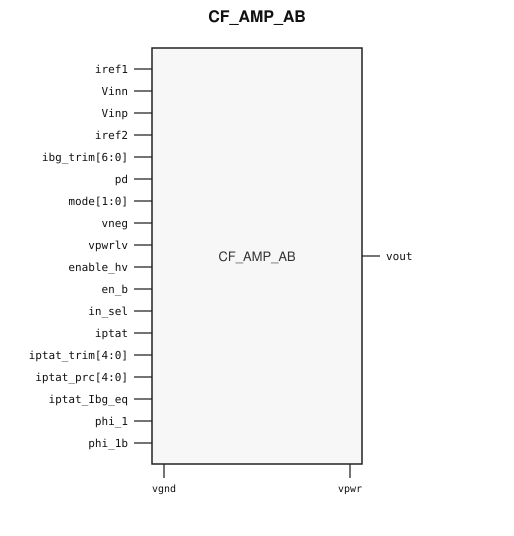

# CF_AMP_AB

> Class AB amplifier

Draft for designer review. The public GDS is an abstract; ChipFoundry
substitutes protected full geometry at tapeout.

This package ships an SRAM-style PG wrap `CF_AMP_AB` around analog leaf
`CF_AMP_AB_core`.

## Overview

`CF_AMP_AB` is a SkyWater 130 nm hard macro Class AB operational amplifier
for continuous-time and switched-capacitor signal conditioning. Instantiate
`CF_AMP_AB`.

Macro size is 373.555 × 288.76 µm (15 µm halo around analog leaf
343.555 × 258.76 µm). Customer PG for chip PDN is `vpwr` / `vgnd`. Low-voltage
analog supply `vpwrlv` stays a wrap port (LEF USE SIGNAL, not chip PDN). Well
taps `vpb` / `vnb` / `vpblv` are tied inside the wrap.

## Installation

```bash
pip install cf-ipm
ipm install CF_AMP_AB --version 0.2.0 --include-drafts
```

Until the marketplace listing is published, install from a local catalog
override the same way `cf-sensor-afe` does:

```bash
ipm install CF_AMP_AB --version 0.2.0 --include-drafts --local-file ip/catalog.json
```

Use `hdl/gl/CF_AMP_AB.v` as the customer blackbox, `layout/lef/CF_AMP_AB.lef`
for P&R, and `layout/gds/CF_AMP_AB.gds` / `layout/mag/CF_AMP_AB.mag` for the
public wrap. `CF_AMP_AB_core` is the analog leaf (empty Verilog, pin-only
abstract). ChipFoundry substitutes vault GDS into `CF_AMP_AB_core` at tapeout.
P&R uses the wrap LEF (`vpwr` / `vgnd` for chip PDN, plus `vpwrlv`).

## Features

- Differential analog inputs `Vinp` / `Vinn` and output `vout`
- Negative analog node `vneg`
- Bias current inputs `iref1` / `iref2` and PTAT current `iptat`
- Power-down `pd`, high-voltage enable `enable_hv`, and active-low enable `en_b`
- Operating mode `mode[1:0]` and input select `in_sel`
- Current trims `ibg_trim[6:0]`, `iptat_trim[4:0]`, `iptat_prc[4:0]`, `iptat_Ibg_eq`
- Chopper clocks `phi_1` / `phi_1b`
- Customer cell `CF_AMP_AB` 373.555 × 288.76 µm (15 µm halo around analog leaf 343.555 × 258.76 µm)
- Chip PDN is `vpwr` / `vgnd`. Analog LV rail `vpwrlv` is a customer signal port.

## Pinout

Customer documentation includes a pinout of the integration cell only.
Internal schematics and architecture block diagrams are not published.



Pin names and directions match the public wrap (`layout/lef/CF_AMP_AB.lef`)
and the blackbox stub (`hdl/gl/CF_AMP_AB.v`).

## Pin Description

Directions and widths are taken from the shipped Verilog in `hdl/gl/CF_AMP_AB.v`.

| Name | Direction | Width | Description |
|---|---|---:|---|
| `vout` | output | 1 | Amplifier analog output. |
| `iref1` | input | 1 | Bias current 1. |
| `Vinn` | input | 1 | Negative analog input. |
| `Vinp` | input | 1 | Positive analog input. |
| `iref2` | input | 1 | Bias current 2. |
| `ibg_trim` | input | 7 | Bandgap current trim. |
| `pd` | input | 1 | Power-down. |
| `mode` | input | 2 | Power / load operating mode. |
| `vneg` | inout | 1 | Negative analog node. |
| `vpwrlv` | input | 1 | Low-voltage analog supply (not chip PDN). |
| `enable_hv` | input | 1 | High-voltage path enable. |
| `en_b` | input | 1 | Active-low enable. |
| `in_sel` | input | 1 | Input select. |
| `iptat` | input | 1 | PTAT current input. |
| `iptat_trim` | input | 5 | PTAT current trim. |
| `iptat_prc` | input | 5 | PTAT precision trim. |
| `iptat_Ibg_eq` | input | 1 | PTAT / bandgap current equalize. |
| `phi_1` | input | 1 | Chopper clock 1. |
| `phi_1b` | input | 1 | Chopper clock 1 complement. |
| `vpwr` | input | 1 | Core supply. |
| `vgnd` | input | 1 | Ground. |

`CF_AMP_AB_core` also has well taps `vpb` / `vnb` / `vpblv`. The wrap ties
`.vpb(vpwr)`, `.vnb(vgnd)`, and `.vpblv(vpwrlv)`. Do not connect those pins
at chip level.

In OpenLane / LibreLane, hook chip PDN with
`PDN_MACRO_CONNECTIONS: "u_cf_amp_ab vccd1 vssd1 vpwr vgnd"` and connect
`.vpwr(vccd1)`, `.vgnd(vssd1)` under `USE_POWER_PINS`. Route `vpwrlv` as an
analog signal. Do not list `vpb` / `vnb` / `vpblv` on the wrapper instance.

## Limitations and Open Issues

- Verilog in `hdl/gl/CF_AMP_AB.v` is a structural wrap around an empty
  `CF_AMP_AB_core` blackbox, not a SPICE-accurate model.
- Liberty is not in this first wrap drop. P&R uses the wrap LEF.
- Companion foundry bias cells stay foundry-only. This package ships the
  amplifier integration top.
- A sensor AFE that also instantiates `CF_BUF_HIZ` / `CF_BGR` / `CF_REFBUF`
  is a follow-on.
